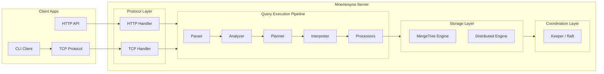
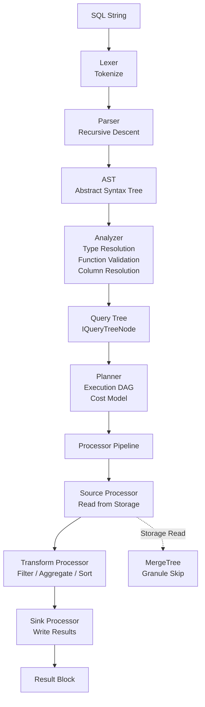
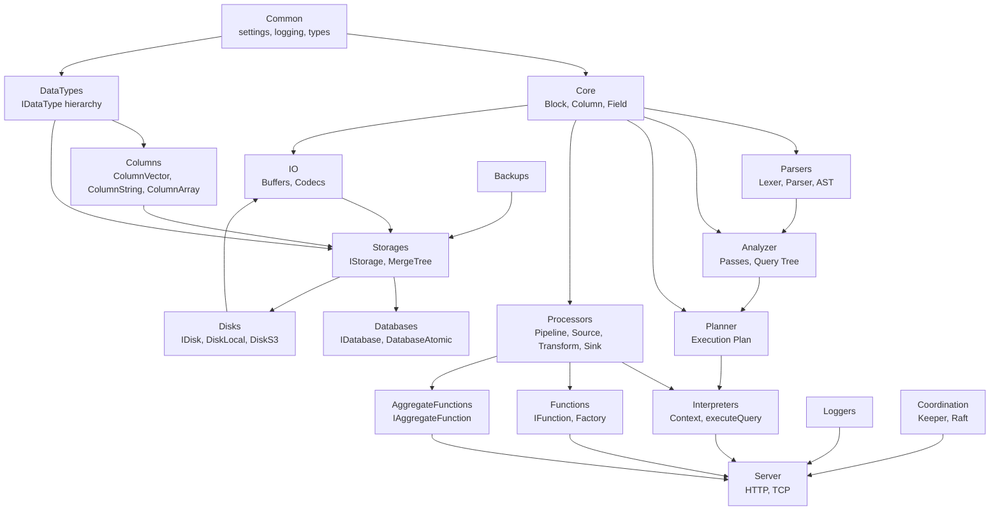
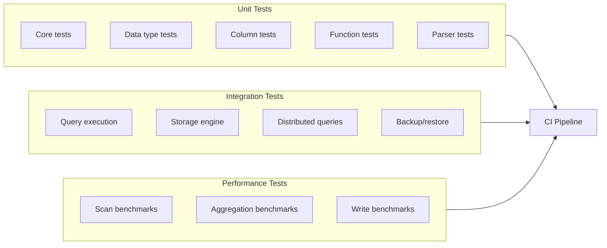

# Mnemosyne

A **column-oriented analytical database management system** written in C++23.

Mnemosyne is designed from the ground up for high-performance OLAP (Online Analytical Processing) workloads. It processes data column-by-column, enabling massive compression ratios and vectorized scan speeds — the same core principle that powers systems like ClickHouse, but built with modern C++23 patterns and a modular, plugin-based architecture.

---

## What Mnemosyne Is

Mnemosyne is a **complete DBMS**, not just a query engine. It includes:

- A **SQL parser** that transforms text into an abstract syntax tree
- A **query analyzer** that validates and resolves types, columns, and functions
- A **query planner** that builds an execution DAG (directed acyclic graph)
- A **processor pipeline** that executes the plan across parallel workers
- A **columnar storage engine** (MergeTree family) with granule-based indexing
- A **distributed coordination layer** (Raft-based consensus)
- **HTTP and TCP servers** for client connectivity
- **Compression codecs** (LZ4, ZSTD) for on-disk and in-transit data
- **Backup and restore** infrastructure

## Architecture Overview



### Data Flow: From SQL to Results



### Module Dependency Graph



---

## Key Concepts

### Columnar Block

The `Block` is the fundamental unit of data flow. It's a rectangular table where each column has the same row count but is stored contiguously by type.

```
Block (6 rows x 3 columns)
┌──────────┬───────────┬──────────┐
│ name     │ age       │ score    │
│ string   │ UInt32    │ Float64  │
├──────────┼───────────┼──────────┤
│ Alice    │ 30        │ 95.5     │
│ Bob      │ 25        │ 87.0     │
│ ...      │ ...       │ ...      │
└──────────┴───────────┴──────────┘
```

### MergeTree Storage

The core storage engine uses **granules** (typically 8192 rows) with primary key indexing. Queries skip non-matching granules, enabling sub-second scans over billions of rows.

```
Data Part Layout
part_001/
  ├── checksums.txt
  ├── columns.txt
  ├── primary.idx        ← granule ranges → PK values
  ├── minmax_timestamp.idx
  ├── data_name.bin.lz4  ← compressed column data
  ├── data_age.bin.lz4
  └── data_score.bin.lz4
```

### Plugin Architecture

Storages, databases, functions, aggregate functions, and codecs are all registered via singleton factories. New functionality is added by implementing an interface and registering it.

```cpp
// Add a new function
MyFunction::registerFunction("my_func");

// Add a new storage engine
StorageFactory::instance().register("MyStorage", createMyStorage);
```

---

## Project Structure

```
mnemosyne/
├── CMakeLists.txt              # Top-level build (CMake 3.28+, C++23)
├── .clang-format               # LLVM-style formatting
├── .clang-tidy                 # Modern C++23 linting
├── .github/workflows/ci.yml    # CI pipeline
├── .gitignore
├── LICENSE                     # Apache 2.0
├── CHANGELOG.md
│
├── src/                        # Core source code
│   ├── Common/                 # Settings, logging, exceptions, thread pool, types
│   ├── Core/                   # Block, Column (IColumn), Field, Series
│   ├── DataTypes/              # IDataType hierarchy + concrete types
│   ├── Columns/                # ColumnVector<T>, ColumnString, ColumnArray
│   ├── Functions/              # IFunction + arithmetic/comparison + factory
│   ├── AggregateFunctions/     # IAggregateFunction + sum/count/avg/min_max + factory
│   ├── Parsers/                # Lexer, recursive descent parser, AST, grammar
│   ├── Analyzer/               # Semantic analysis, passes, query tree
│   ├── Planner/                # Query planner, execution DAG
│   ├── Interpreters/           # Context, executeQuery, DDL interpreter
│   ├── Processors/             # IProcessor, pipeline, source/transform/sink
│   ├── Storages/               # IStorage + MergeTree + distributed
│   ├── Databases/              # IDatabase + atomic database
│   ├── Disks/                  # IDisk + local/S3 backends
│   ├── IO/                     # Read/Write buffers, compression codecs
│   ├── Server/                 # HTTP server, TCP server, metrics
│   ├── Coordination/           # Keeper (Raft consensus)
│   ├── Backups/                # Backup/restore infrastructure
│   └── Loggers/                # Logging infrastructure
│
├── programs/
│   ├── server/main.cpp         # Server daemon entry point
│   ├── client/main.cpp         # CLI client entry point
│   └── keeper/main.cpp         # Keeper service entry point
│
├── tests/                      # Test infrastructure (Catch2)
│   ├── unit/                   # Unit tests
│   └── integration/            # Integration tests
│
├── benchmark/                  # Performance benchmarks (Google Benchmark)
│
├── cmake/                      # Build helpers (arch, tools, sanitize, warnings)
├── configs/                    # Configuration files
│   └── mnemosyne.example.yml
├── docker/
│   ├── Dockerfile
│   └── docker-compose.yml
└── docs/
    ├── ARCHITECTURE.md         # Deep architecture reference
    ├── GRAMMAR.md              # SQL grammar reference
    └── API.md                  # API documentation
```

---

## Build & Run

### Prerequisites

- CMake 3.28+
- C++23 compiler (GCC 14+, Clang 18+, or MSVC 19.40+)
- Ninja (recommended) or Make

### Build

```bash
# Clone
git clone https://github.com/mnemosyne-db/mnemosyne.git
cd mnemosyne

# Configure
cmake -S . -B build \
    -DCMAKE_BUILD_TYPE=Release \
    -DENABLE_TESTS=ON \
    -DENABLE_BENCHMARK=ON

# Build
cmake --build build -j$(nproc)
```

### Run

```bash
# Start the server
./build/programs/server/mnemosyne_server configs/mnemosyne.example.yml

# Connect with the CLI client
./build/programs/client/mnemosyne_client --host 127.0.0.1 --port 9000

# Or via HTTP
curl 'http://127.0.0.1:8123/?query=SELECT%201'
```

### Run with Docker

```bash
cd docker
docker-compose up -d
```

### Run Tests

```bash
cmake --build build
ctest --test-dir build --output-on-failure
```

---

## SQL Support

Mnemosyne supports a core SQL dialect for analytical queries:

```sql
-- SELECT with filtering, aggregation, and ordering
SELECT
    region,
    count() AS orders,
    sum(amount) AS total,
    avg(amount) AS avg_order
FROM orders
WHERE date >= '2025-01-01'
  AND date < '2025-02-01'
  AND status = 'completed'
GROUP BY region
HAVING total > 1000
ORDER BY total DESC
LIMIT 10;

-- CREATE TABLE with MergeTree engine
CREATE TABLE orders (
    id        UInt64,
    date      Date,
    region    String,
    amount    Float64,
    status    LowCardinality(String)
)
ENGINE = MergeTree()
PRIMARY KEY (region, date)
ORDER BY (region, date, id);

-- INSERT
INSERT INTO orders VALUES (1, '2025-01-15', 'US-East', 99.50, 'completed');
```

---

## Design Decisions

| Decision | Choice | Rationale |
|----------|--------|-----------|
| Language | C++23 | Zero-cost abstractions, modern type system (`std::expected`, concepts) |
| Build System | CMake 3.28+ | Cross-platform, industry standard for C++ |
| Storage Engine | MergeTree family | Granule-based indexing enables massive scans |
| Coordination | Raft (Keeper) | Proven consensus algorithm for distributed consistency |
| Compression | LZ4 + ZSTD | LZ4 for speed, ZSTD for archival ratio |
| Test Framework | Catch2 | Header-only, modern C++ test framework |
| Benchmark | Google Benchmark | Industry standard for C++ performance measurement |
| Formatting | LLVM style | Consistent, widely adopted in C++ projects |

---

## Testing Strategy



---

## Development Roadmap

The project follows a phased approach. Each phase builds on the previous one.

### Phase 0: Foundation (Done)
- Project scaffold with CMake build system
- Core data types (Block, Column, Field, DataType)
- Column implementations (Vector, String, Array)
- Function and aggregate function frameworks
- SQL parser with recursive descent
- Query analyzer and planner interfaces
- Processor pipeline architecture
- Storage engine interfaces
- Server (HTTP/TCP) interfaces
- Coordination layer interfaces
- Logging and settings infrastructure

### Phase 1: Core Engine
- Full SQL parser implementation (grammar.y)
- Query analyzer passes (type inference, constant folding, column pruning)
- Query planner with cost model
- Full processor implementations (aggregating, filter, limit, sort)
- MergeTree storage engine (write path)
- MergeTree storage engine (read path with granule skipping)
- Block writing and reading

### Phase 2: Storage & Query Execution
- MergeTree variants (Aggregating, Summing, Collapsing)
- Distributed table engine (StorageDistributed)
- Remote query execution
- Data compression (full LZ4, ZSTD codecs)
- Disk abstraction (S3 backend)
- Backup and restore

### Phase 3: Distributed System
- Keeper service (Raft consensus)
- Multi-node cluster support
- Distributed DDL execution
- ReplicatedMergeTree
- Cluster topology management

### Phase 4: Production Readiness
- Full SQL dialect (JOINs, subqueries, window functions)
- Data types (Date/DateTime64, UUID, LowCardinality, Map, Tuple)
- Format support (JSON, CSV, Parquet, Arrow)
- Authentication and authorization
- Query logging and monitoring
- Performance optimization (SIMD vectorization, parallel replicas)
- Comprehensive test suite

### Phase 5: Maturity
- Materialized views
- TTL policies
- Column projections
- Bloom index and secondary indexes
- Replication lag monitoring
- Production deployment guides

---

## TODO Checklist

### Completed

- [x] Project scaffold with CMake 3.28+ build system
- [x] Root configuration (.clang-format, .clang-tidy, .gitignore, CI workflow)
- [x] Core data model interfaces (Block, IColumn, Field, Series)
- [x] DataType hierarchy (IDataType, DataTypeNumber, DataTypeString, DataTypeDate, factory)
- [x] Column implementations (ColumnVector, ColumnString, ColumnArray)
- [x] Scalar function framework (IFunction, arithmetic, comparison, function factory)
- [x] Aggregate function framework (IAggregateFunction, sum, count, avg, min/max, factory)
- [x] SQL parser interfaces (Lexer, Parser base, AST node types, grammar stub)
- [x] Query analyzer interfaces (analyzer, passes, query tree)
- [x] Query planner interfaces (planner, execution plan DAG)
- [x] Query interpreter interfaces (Context, executeQuery, DDL interpreter)
- [x] Processor pipeline architecture (IProcessor, pipeline, source/transform/sink)
- [x] Storage engine interfaces (IStorage, factory, file/memory/dictionary storage)
- [x] Database engine interfaces (IDatabase, database factory, memory database)
- [x] Disk abstraction (IDisk, disk_local, disk_s3)
- [x] I/O infrastructure (ReadBuffer/WriteBuffer, compression codec interface, LZ4/ZSTD stubs)
- [x] Server interfaces (HTTP server, TCP server, metrics)
- [x] Coordination layer interface (Keeper/Raft consensus stub)
- [x] Backup infrastructure interface
- [x] Logging infrastructure (Logger, ConsoleTarget, FileTarget)
- [x] Common utilities (Settings, ThreadPool, exceptions, types)
- [x] Program entry points (server, client, keeper)
- [x] Test infrastructure skeleton (Catch2 setup)
- [x] Benchmark infrastructure skeleton (Google Benchmark setup)
- [x] Docker support (Dockerfile, docker-compose)
- [x] Configuration example (mnemosyne.example.yml)
- [x] Documentation scaffold (ARCHITECTURE.md, GRAMMAR.md, API.md)
- [x] Apache 2.0 license
- [x] CHANGELOG.md

### Remaining: Phase 1 — Core Engine

- [ ] Implement full SQL grammar (grammar.y) with ANTLR4 code generation
- [ ] Implement Lexer tokenizer (complete token types, whitespace, string literals)
- [ ] Implement Parser recursive descent (all grammar rules: SELECT, INSERT, CREATE, ALTER, DROP)
- [ ] Implement AST node types (complete all AST* classes with visitor pattern)
- [ ] Implement QueryAnalyzer (type resolution, column name resolution, function validation)
- [ ] Implement analyzer passes (type inference, constant folding, column pruning, dead code elimination)
- [ ] Implement IQueryTreeNode hierarchy (SelectNode, JoinNode, AggregateNode, etc.)
- [ ] Implement QueryPlanner (build execution DAG from query tree)
- [ ] Implement cost model (scan cost, aggregation cost, join cost estimation)
- [ ] Implement SourceProcessor (data source for MergeTree, Memory, etc.)
- [ ] Implement TransformProcessor base class
- [ ] Implement AggregatingProcessor (parallel aggregation with intermediate states)
- [ ] Implement FilterProcessor (predicate evaluation on columns)
- [ ] Implement SortProcessor (external sort for large datasets)
- [ ] Implement LimitProcessor (top-N and offset processing)
- [ ] Implement QueryPipeline executor (parallel execution with channels)
- [ ] Implement Context (full settings system with thread safety)
- [ ] Implement executeQuery (end-to-end query execution)

### Remaining: Phase 2 — Storage & Query Execution

- [ ] Implement MergeTreeDataPart (data part on-disk format, checksums, metadata)
- [ ] Implement MergeTreeWriter (batch writing blocks to parts)
- [ ] Implement MergeTreeReader (block reading with granule skipping)
- [ ] Implement primary key index (skipping index over granules)
- [ ] Implement granule cache (in-memory cache for hot data)
- [ ] Implement MergeTree background merger (asynchronous part merging)
- [ ] Implement MergeTree variants (AggregatingMergeTree, SummingMergeTree, CollapsingMergeTree)
- [ ] Implement Distributed storage engine
- [ ] Implement RemoteQueryExecutor (cross-node query execution)
- [ ] Implement full LZ4 codec (real compression/decompression)
- [ ] Implement full ZSTD codec (real compression/decompression)
- [ ] Implement native codec (no-op, direct write)
- [ ] Implement S3 disk backend (full AWS S3 integration)
- [ ] Implement backup infrastructure (full backup/restore for MergeTree)
- [ ] Implement format readers/writers (JSON, CSV, Parquet, Arrow)

### Remaining: Phase 3 — Distributed System

- [ ] Implement Keeper service (full Raft consensus)
- [ ] Implement Raft log store (persistent log with snapshots)
- [ ] Implement Raft state machine (apply committed entries)
- [ ] Implement Keeper client protocol (ZooKeeper wire protocol)
- [ ] Implement multi-node cluster support
- [ ] Implement distributed DDL execution (DDLWorker)
- [ ] Implement ReplicatedMergeTree (replicated data parts across nodes)
- [ ] Implement cluster topology management (node discovery, membership)
- [ ] Implement shard routing (query distribution across nodes)

### Remaining: Phase 4 — Production Readiness

- [ ] Implement JOINs (HashJoin, NestedJoin, MergeJoin)
- [ ] Implement subqueries (scalar, correlated, IN subqueries)
- [ ] Implement window functions (ROW_NUMBER, RANK, SUM OVER, etc.)
- [ ] Implement additional data types (Date/DateTime64, UUID, LowCardinality, Map, Tuple)
- [ ] Implement authentication (user management, password, certificate-based)
- [ ] Implement authorization (roles, privileges, ACL)
- [ ] Implement query logging (slow query log, trace log)
- [ ] Implement metrics collection (Prometheus-compatible, system tables)
- [ ] Implement SIMD vectorization (AVX2/AVX-512 for arithmetic, comparison, aggregation)
- [ ] Implement parallel replicas (parallel scan across replicas)
- [ ] Implement memory tracker (per-query memory accounting with limits)
- [ ] Implement query timeout and cancellation
- [ ] Implement materialized views
- [ ] Implement TTL policies (automatic data expiration)

### Remaining: Phase 5 — Maturity

- [ ] Implement bloom index (secondary index for fast lookups)
- [ ] Implement column projections (read only needed columns)
- [ ] Implement replication lag monitoring
- [ ] Implement production deployment guides (Kubernetes, bare metal)
- [ ] Implement performance regression tests (benchmark suite)
- [ ] Implement fuzzing tests (SQL injection, malformed queries)
- [ ] Implement documentation (user manual, SQL reference, admin guide)
- [ ] Implement release process (versioning, changelog, packaging)

---

## Contributing

See [CONTRIBUTING.md](CONTRIBUTING.md) for detailed guidelines on:

- Setting up the development environment
- Coding standards (C++23, LLVM style)
- Testing requirements
- Pull request process
- Review process

---

## License

Apache License 2.0. See [LICENSE](LICENSE) for details.