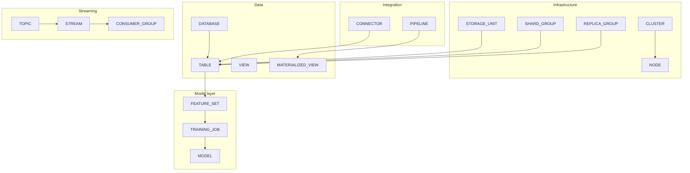

# First-Class Entities

Mnemo extends SQL with catalog objects for storage, cluster topology, data integration, orchestration, streaming, and machine learning. Each first-class entity has its own **CREATE**, **ALTER** (where applicable), **DROP**, **SHOW**, **DESCRIBE**, metadata, and lifecycle — managed entirely through Mnemo SQL, not a separate admin API.

> **Rule of thumb:** If something needs catalog CRUD, permissions, and lifecycle management, it is first-class. Otherwise it is a property of another entity (e.g. a table column) or a runtime verb (e.g. `RUN PIPELINE`).

## Domain map

| Domain | Entities | Status |
|--------|----------|--------|
| **Data** | `DATABASE`, `TABLE`, `VIEW`, `MATERIALIZED_VIEW` | Implemented |
| **Infrastructure** | `CLUSTER`, `NODE`, `STORAGE_UNIT`, `REPLICA_GROUP`, `SHARD_GROUP` | Implemented |
| **Integration** | `CONNECTOR` | Implemented |
| **Pipeline** | `PIPELINE`, `STAGE`, `TASK`, `TRIGGER` | Implemented |
| **Streaming** | `TOPIC`, `STREAM`, `CONSUMER_GROUP` | Implemented |
| **AI / Model** | `FEATURE_SET`, `DATASET`, `MODEL`, `MODEL_TEMPLATE`, `TRAINING_JOB`, `TUNING_JOB`, `MODEL_ENDPOINT` | Implemented |
| **Governance** | `USER`, `ROLE`, `POLICY`, `SECRET` | Planned (PRD) |
| **Decision intelligence** | `METRIC`, `KPI`, `ALERT`, `INSIGHT` | Planned (PRD) |

## Entity capability matrix

| Entity | CREATE | DROP | ALTER | SHOW | DESCRIBE | Control verbs |
|--------|--------|------|-------|------|----------|---------------|
| Database | ✓ | — | — | ✓ | — | `USE` |
| Table | ✓ | ✓ | ✓ | ✓ | ✓ | — |
| View | ✓ | ✓ | — | ✓ | ✓ | — |
| Materialized view | ✓ | ✓ | — | ✓ | ✓ | `REFRESH` |
| Storage unit | ✓ | ✓ | — | ✓ | ✓ | — |
| Node | ✓ | ✓ | ✓ | ✓ | ✓ | `REGISTER`, `DRAIN`, `REMOVE` |
| Cluster | ✓ | — | — | ✓ | ✓ | — |
| Replica group | ✓ | ✓ | ✓ | ✓ | ✓ | — |
| Shard group | ✓ | ✓ | ✓ | ✓ | ✓ | — |
| Connector | ✓ | ✓ | ✓ | ✓ | ✓ | `TEST`, `DISCOVER SCHEMA` |
| Pipeline / stage / task / trigger | ✓ | ✓ | ✓ | ✓ | ✓ | `RUN`, `PAUSE`, `RESUME` |
| Topic / stream / consumer group | ✓ | ✓ | ✓ | ✓ | ✓ | `PUBLISH`, `SUBSCRIBE` |
| Feature set / model / jobs | ✓ | ✓ | — | ✓ | ✓ | `RUN`, `DEPLOY`, `PREDICT`, `EVALUATE`, `COMPARE`, `GENERATE` |

## How entities relate



## Binding entities to tables

Placement clauses are optional and order-independent after the column list and `ENGINE`:

```sql
CREATE TABLE sales (
    id          Int64,
    customer_id Int64,
    amount      Float64
) ENGINE = Memory
  STORAGE_UNIT warehouse_local
  SHARD_GROUP customer_distribution
  REPLICA_GROUP standard_ha;
```

## Control verbs (non-DDL)

| Verb | Target | Example |
|------|--------|---------|
| `REGISTER NODE` | Node | `REGISTER NODE w02 HOST '10.0.0.2' PORT 9001` |
| `DRAIN NODE` | Node | `DRAIN NODE w02` |
| `REMOVE NODE` | Node | `REMOVE NODE IF EXISTS w02` |
| `TEST CONNECTOR` | Connector | `TEST CONNECTOR stripe_api` |
| `DISCOVER SCHEMA FROM CONNECTOR` | Connector | `DISCOVER SCHEMA FROM CONNECTOR stripe_api` |
| `RUN PIPELINE` | Pipeline | `RUN PIPELINE nightly_etl` |
| `PAUSE PIPELINE` | Pipeline | `PAUSE PIPELINE nightly_etl` |
| `RESUME PIPELINE` | Pipeline | `RESUME PIPELINE nightly_etl` |
| `PUBLISH` | Topic | `PUBLISH user_activity VALUES ('evt-1', 'click')` |
| `SUBSCRIBE` | Stream | `SUBSCRIBE user_events CONSUMER_GROUP analytics LIMIT 100` |
| `RUN TRAINING_JOB` | ML | `RUN TRAINING_JOB churn_training` |
| `RUN TUNING_JOB` | ML | `RUN TUNING_JOB tune_rf` |
| `DEPLOY MODEL` | ML | `DEPLOY MODEL churn_model:1 AS churn_api` |
| `PREDICT MODEL` | ML | `PREDICT MODEL churn_model:1 FOR (customer_id=42)` |
| `EVALUATE MODEL` | ML | `EVALUATE MODEL churn_model:1` |
| `COMPARE MODELS` | ML | `COMPARE MODELS model_a:1, model_b:1` |

## HTTP access pattern

All entity operations use the same query endpoint:

```bash
curl -G "http://127.0.0.1:1143/query" \
  --data-urlencode "query=SHOW NODES" \
  --data-urlencode "format=JSON"
```

```python
from scripts._mnemo_client import Client

client = Client("http://127.0.0.1:1143")
r = client.query("SHOW STORAGE_UNITS")
assert r.ok()
```

## Documentation index

### Data layer
- [data-layer.md](data-layer.md) — `DATABASE`, `TABLE`, `VIEW`, `MATERIALIZED_VIEW`

### Infrastructure
- [storage-units.md](storage-units.md) — `STORAGE_UNIT`
- [nodes-and-clusters.md](nodes-and-clusters.md) — `NODE`, `CLUSTER`
- [replication.md](replication.md) — `REPLICA_GROUP`
- [sharding.md](sharding.md) — `SHARD_GROUP`

### Integration and orchestration
- [connectors.md](connectors.md) — `CONNECTOR`
- [pipelines.md](pipelines.md) — `PIPELINE`, `STAGE`, `TASK`, `TRIGGER`

### Streaming
- [streams.md](streams.md) — `TOPIC`, `STREAM`, `CONSUMER_GROUP`

### Model layer
- [../model-layer/README.md](../model-layer/README.md) — overview
- [../model-layer/catalog.md](../model-layer/catalog.md) — CREATE / SHOW / DESCRIBE
- [../model-layer/workflows.md](../model-layer/workflows.md) — end-to-end ML workflows
- [../model-layer/training-and-jobs.md](../model-layer/training-and-jobs.md) — training and tuning
- [../model-layer/inference.md](../model-layer/inference.md) — deploy and predict
- [../model-layer/visualizations.md](../model-layer/visualizations.md) — charts and monitoring

## Integration tests

Each entity has runnable API tests under `scripts/`:

| Entity | Test script |
|--------|-------------|
| Storage unit | `test_storage_units_api.py` |
| Node / cluster | `test_nodes_api.py` |
| Replica group | `test_replica_groups_api.py` |
| Shard group | `test_shard_groups_api.py` |
| Connector | `test_connectors_api.py` |
| Pipeline | `test_pipelines_api.py` |
| Stream | `test_streams_api.py` |
| Model layer | `test_models_api.py`, `test_tuning_api.py` |

## Future entities (PRD only)

The PRD (`docs/PRDS/FIRST_CLASS_ENTITIES.md`) describes additional planned entities: `ORGANIZATION`, `PROJECT`, `ENVIRONMENT`, `INDEX`, `WINDOW`, `JOB`, `VECTOR_INDEX`, `KNOWLEDGE_BASE`, `METRIC`, `KPI`, `ALERT`, governance objects, and more. These are **not** parsed by the current SQL grammar — consult the grammar reference before using them.
