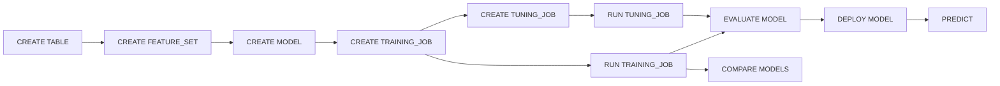

# Model Layer SQL

Mnemo SQL includes verbs and catalog objects for machine learning: feature sets, models, training jobs, tuning jobs, deployment, and inference. The C++ server orchestrates lifecycle; training and prediction spawn the **Python ML runtime** (`ml_runtime/`) when scikit-learn and dependencies are available.

## Design principles

1. **MODEL ≠ ALGORITHM** — `churn_model` is the business asset; `RandomForestClassifier` is one implementation.
2. **No implicit feature discovery** — entity keys, features, and targets must be declared in `FEATURE_SET`.
3. **Full reproducibility** — every prediction traces to version, run, hyperparameters, and feature set.
4. **Framework independence** — Mnemo orchestrates; scikit-learn/XGBoost/PyTorch execute.

## Lifecycle overview



## First-class model entities

| Entity | Purpose |
|--------|---------|
| `FEATURE_SET` | Declared input columns, entity key, target |
| `DATASET` | Raw data reference (deep learning / LLM paths) |
| `MODEL` | Logical business model |
| `MODEL_TEMPLATE` | Reusable framework/algorithm/hyperparameter preset |
| `TRAINING_JOB` | Training configuration binding model + features |
| `TUNING_JOB` | Hyperparameter search over a training job |
| `MODEL_VERSION` | Immutable trained artifact (created by `RUN`) |
| `MODEL_ENDPOINT` | Named deployment (created by `DEPLOY`) |
| `PREDICTION_TABLE` | Batch scoring output (created by `PREDICT FROM`) |

## Documentation

| Guide | Topics |
|-------|--------|
| [catalog.md](catalog.md) | CREATE / DROP / SHOW / DESCRIBE for all entities |
| [workflows.md](workflows.md) | **End-to-end ML workflow** with code examples |
| [training-and-jobs.md](training-and-jobs.md) | Training and hyperparameter tuning |
| [inference.md](inference.md) | DEPLOY, PREDICT, EVALUATE, COMPARE, GENERATE |
| [visualizations.md](visualizations.md) | Charts, dashboards, monitoring |

## Quick end-to-end example

```sql
USE model_test_db;

CREATE TABLE ml_customers (
    customer_id Int64,
    tenure Int64,
    monthly_charges Float64,
    support_calls Int64,
    churn Int64
) ENGINE = Memory;

INSERT INTO ml_customers VALUES
    (1, 3, 95.5, 6, 1),
    (2, 24, 45.0, 1, 0);
-- ... 50+ rows recommended

CREATE FEATURE_SET churn_features
    FROM ml_customers
    ENTITY_KEY(customer_id)
    FEATURES(tenure, monthly_charges, support_calls)
    TARGET churn;

CREATE MODEL churn_model TYPE CLASSIFICATION;

CREATE TRAINING_JOB churn_training
    MODEL churn_model
    FEATURE_SET churn_features
    FRAMEWORK SKLEARN
    ALGORITHM RandomForestClassifier
    OBJECTIVE ACCURACY
    HYPERPARAMS(n_estimators=60, max_depth=6);

RUN TRAINING_JOB churn_training;

EVALUATE MODEL churn_model:1;
DEPLOY MODEL churn_model:1 AS churn_endpoint;

PREDICT MODEL churn_model:1 WITH (tenure=2, monthly_charges=95.0, support_calls=5);
PREDICT MODEL churn_model:1 FOR (customer_id=2);
PREDICT MODEL churn_model:1 FROM ml_customers;
```

## HTTP / Python access

```python
from scripts._mnemo_client import Client

client = Client("http://127.0.0.1:1143")
r = client.query("RUN TRAINING_JOB churn_training")
print(r.json())
```

```bash
curl -G "http://127.0.0.1:1143/query" \
  --data-urlencode "query=PREDICT MODEL churn_model:1 FOR (customer_id=2)" \
  --data-urlencode "format=JSON"
```

## Version syntax

```sql
EVALUATE MODEL churn_model:1;
EVALUATE MODEL churn_model:v1;
DEPLOY MODEL churn_model:1 AS endpoint_a;
```

Omitting version selects latest where supported.

## Frameworks and algorithms

| Framework | Example algorithms |
|-----------|-------------------|
| `SKLEARN` | `RandomForestClassifier`, `LogisticRegression`, `LinearRegression` |
| `XGBOOST` | `XGBClassifier`, `XGBRegressor` |
| `LIGHTGBM` | `LGBMClassifier` |
| `PYTORCH` / `TENSORFLOW` | Custom via `ENTRYPOINT` |

Registry: `ml_runtime/`.

## Prerequisites

```bash
pip install scikit-learn pandas numpy joblib
# optional for advanced tuning
pip install optuna
```

Set `MNEMO_PYTHON` to point the server at the correct interpreter.

## Integration tests

- `scripts/test_models_api.py` — full lifecycle
- `scripts/test_tuning_api.py` — hyperparameter search
- `scripts/test_ml_runtime.py` — runtime unit tests

## Related PRDs

- `docs/PRDS/MODEL_LAYER_.md`
- `docs/changelog/060626-model_layer_changelog.md`
