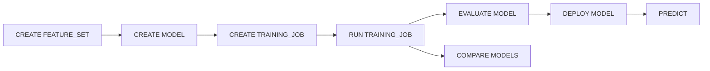

# Model Layer SQL

Mnemo SQL includes verbs and catalog objects for machine learning: feature sets, models, training jobs, deployment, and inference. Execution uses the Python ML runtime when scikit-learn (and dependencies) are available.

## Lifecycle overview



## Subsections

- [catalog.md](catalog.md) — CREATE / DROP / SHOW / DESCRIBE
- [training-and-jobs.md](training-and-jobs.md) — training and tuning jobs
- [inference.md](inference.md) — DEPLOY, PREDICT, EVALUATE, COMPARE, GENERATE

## Quick end-to-end example

```sql
USE model_test_db;

CREATE TABLE ml_customers (
    customer_id Int64,
    tenure Int64,
    monthly_charges Float64,
    support_calls Int64,
    churn Int64
) ENGINE = Memory;

INSERT INTO ml_customers VALUES ...;

CREATE FEATURE_SET churn_features
    FROM ml_customers
    ENTITY_KEY(customer_id)
    FEATURES(tenure, monthly_charges, support_calls)
    TARGET churn;

CREATE MODEL churn_model TYPE CLASSIFICATION;

CREATE TRAINING_JOB churn_training
    MODEL churn_model
    FEATURE_SET churn_features
    FRAMEWORK SKLEARN
    ALGORITHM RandomForestClassifier
    OBJECTIVE ACCURACY
    HYPERPARAMS(n_estimators=60, max_depth=6);

RUN TRAINING_JOB churn_training;

EVALUATE MODEL churn_model:1;
DEPLOY MODEL churn_model:1 AS churn_endpoint;

PREDICT MODEL churn_model:1 WITH (tenure=2, monthly_charges=95.0, support_calls=5);
PREDICT MODEL churn_model:1 FOR (customer_id=2);
PREDICT MODEL churn_model:1 FROM ml_customers;
```

See `scripts/test_models_api.py` and `docs/PRDS/MODEL_LAYER_.md`.

## Version syntax

Model versions use `model_name:vN` or `model_name:N` after colon:

```sql
EVALUATE MODEL churn_model:1;
DEPLOY MODEL churn_model:1 AS endpoint_a;
```

Omitting version selects latest where supported.

## Frameworks and algorithms

`FRAMEWORK SKLEARN` with `ALGORITHM RandomForestClassifier`, `LogisticRegression`, etc. maps to the ML runtime registry in `ml_runtime/`.
