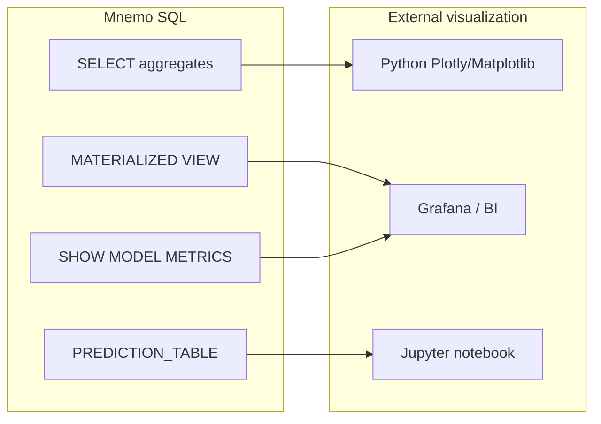

# Visualizations and Monitoring

Mnemo SQL does not embed a charting engine. Visualization workflows combine **SQL for data preparation**, **materialized views for dashboard datasets**, **model monitoring commands**, and **external chart tools** (Python, Grafana, BI platforms) consuming JSON query results.

## Architecture



---

## 1. Analytical charts from SQL

Use `SELECT` with `GROUP BY` to produce chart-ready series.

### Time series

```sql
SELECT
    toDate(created) AS day,
    count(*) AS orders,
    sum(amount) AS revenue
FROM orders
GROUP BY day
ORDER BY day;
```

### Category breakdown (bar / pie)

```sql
SELECT region, sum(amount) AS total
FROM orders
GROUP BY region
ORDER BY total DESC;
```

### Histogram-style buckets

```sql
SELECT
    floor(monthly_charges / 10) * 10 AS charge_bucket,
    count(*) AS customers
FROM ml_customers
GROUP BY charge_bucket
ORDER BY charge_bucket;
```

Export via HTTP JSON and plot:

```python
import json
import urllib.parse
import urllib.request

def query(sql: str) -> list[dict]:
    url = "http://127.0.0.1:1143/query?" + urllib.parse.urlencode(
        {"query": sql, "format": "JSON"}
    )
    with urllib.request.urlopen(url) as resp:
        data = json.loads(resp.read())
    cols = data["columns"]
    return [dict(zip(cols, row)) for row in data["data"]]

rows = query(
    "SELECT region, sum(amount) AS total FROM orders GROUP BY region ORDER BY total DESC"
)

# Example: matplotlib bar chart
import matplotlib.pyplot as plt

labels = [r["region"] for r in rows]
values = [r["total"] for r in rows]
plt.bar(labels, values)
plt.title("Revenue by region")
plt.savefig("revenue_by_region.png")
```

---

## 2. Materialized views for dashboards

Pre-compute expensive aggregates and refresh on a schedule.

```sql
CREATE MATERIALIZED VIEW dashboard_kpis AS
SELECT
    count(*) AS total_customers,
    sum(churn) AS churned,
    sum(churn) / count(*) AS churn_rate,
    avg(monthly_charges) AS avg_charges
FROM ml_customers;

REFRESH MATERIALIZED VIEW dashboard_kpis;

SELECT * FROM dashboard_kpis;
```

### Daily metric trend

```sql
CREATE MATERIALIZED VIEW daily_metrics AS
SELECT
    toDate(event_time) AS day,
    count(*) AS events,
    uniq(user_id) AS unique_users
FROM user_events
GROUP BY day;

-- Refresh nightly via pipeline
CREATE TASK refresh_daily_metrics IN STAGE reporting IN PIPELINE nightly
    TYPE SQL
    BODY 'REFRESH MATERIALIZED VIEW daily_metrics';
```

Grafana or a BI tool can poll:

```sql
SELECT day, events, unique_users FROM daily_metrics ORDER BY day;
```

---

## 3. Model evaluation visualizations

### Confusion matrix data

After batch prediction:

```sql
PREDICT MODEL churn_model:1 FROM ml_customers;

SELECT
    c.churn AS actual_label,
    cast(p.prediction AS Int64) AS predicted_label,
    count(*) AS count
FROM ml_customers c
JOIN churn_model_predictions p
    ON cast(c.customer_id AS String) = p.entity_key
GROUP BY actual_label, predicted_label
ORDER BY actual_label, predicted_label;
```

Plot as a heatmap in Python:

```python
rows = query("""
    SELECT c.churn AS actual, cast(p.prediction AS Int64) AS predicted, count(*) AS n
    FROM ml_customers c
    JOIN churn_model_predictions p ON cast(c.customer_id AS String) = p.entity_key
    GROUP BY actual, predicted
""")

# Build 2x2 matrix for binary classification
import numpy as np
matrix = np.zeros((2, 2))
for r in rows:
    matrix[int(r["actual"])][int(r["predicted"])] = r["n"]
```

### ROC / threshold analysis (SQL prep)

```sql
SELECT
    prediction,
    confidence,
    churn AS actual
FROM churn_model_predictions p
JOIN ml_customers c ON cast(c.customer_id AS String) = p.entity_key
ORDER BY confidence DESC;
```

Export and compute ROC in scikit-learn:

```python
import pandas as pd
from sklearn.metrics import RocCurveDisplay

rows = query("...")  # query above
df = pd.DataFrame(rows)
RocCurveDisplay.from_predictions(df["actual"], df["confidence"])
```

### Compare models

```sql
COMPARE MODELS churn_model:1, churn_model_b:1;
```

Returns side-by-side metrics suitable for a comparison bar chart.

---

## 4. Hyperparameter tuning visualizations

After `RUN TUNING_JOB`:

```sql
RUN TUNING_JOB tune_rf;
```

The JSON response includes per-trial rows with `params` and `objective_value`. Parse and scatter-plot:

```python
r = client.query("RUN TUNING_JOB tune_rf")
trials = [row for row in _rows(r.body) if not str(row.get("trial", "")).startswith("best")]

depths = [eval(row["params"])["max_depth"] for row in trials]  # if params is dict-like string
scores = [row["objective_value"] for row in trials]
```

Or inspect via follow-up catalog queries:

```sql
SHOW MODEL VERSIONS churn_model;
DESCRIBE MODEL VERSION churn_model:v1;
```

---

## 5. Model monitoring (built-in metrics)

Mnemo tracks endpoint-level counters without external tooling.

```sql
-- After predictions
SHOW MODEL METRICS churn_model;
SHOW MODEL ENDPOINTS churn_model;
SHOW MODEL DRIFT churn_model;
```

### Typical metric fields

| Field | Use in dashboards |
|-------|-------------------|
| `prediction_count` | Throughput / usage |
| `failure_count` | Error rate |
| `avg_latency_ms` | Latency (derived from `total_latency_ms / prediction_count`) |
| drift signals | Data/concept drift monitoring |

### Latency snapshot query pattern

```sql
SELECT
    endpoint,
    prediction_count,
    failure_count,
    total_latency_ms / greatest(prediction_count, 1) AS avg_latency_ms
FROM model_endpoints_view;  -- if exposed via SHOW parsing, use SHOW MODEL ENDPOINTS
```

---

## 6. Streaming metrics

For real-time pipelines:

```sql
SHOW STREAM METRICS FOR STREAM user_events;
```

Useful panels:

- Event throughput
- Consumer lag (`consumer_lag` in stream metrics)
- Partition distribution

```sql
SHOW TOPICS;
SHOW CONSUMER_GROUPS;
```

---

## 7. Pipeline run observability

```sql
SHOW PIPELINE RUNS FOR PIPELINE nightly_etl;
SHOW PIPELINE METRICS FOR PIPELINE nightly_etl;
```

Build operational dashboards from:

- Run `status` (`SUCCEEDED`, `FAILED`)
- Task-level `duration_ms`
- Failure `error` messages

---

## 8. Infrastructure health charts

### Node utilization

```sql
SHOW NODE METRICS;
SHOW NODE METRICS worker_01;
```

Fields include `cpu_utilization_pct`, `memory_used_bytes`, `query_throughput`.

### Storage usage

```sql
SHOW STORAGE_USAGE;
SHOW STORAGE_UNITS;
```

Plot capacity vs. used bytes per storage unit.

### Replication / sharding status

```sql
SHOW REPLICATION STATUS;
SHOW SHARD STATUS;
```

---

## 9. Recommended visualization stack

| Use case | Mnemo SQL role | External tool |
|----------|----------------|-----------------|
| Executive KPI dashboard | `MATERIALIZED VIEW` + `REFRESH` | Grafana, Metabase |
| ML experiment tracking | `SHOW MODEL VERSIONS`, `COMPARE MODELS` | Notebook + Plotly |
| Model ops monitoring | `SHOW MODEL METRICS`, `SHOW MODEL DRIFT` | Custom Grafana panel |
| ETL observability | `SHOW PIPELINE RUNS` | PagerDuty + dashboard |
| Ad-hoc exploration | `SELECT` aggregates | Jupyter + pandas |

---

## 10. JSON response format for chart clients

All HTTP queries with `format=JSON` return:

```json
{
  "columns": ["region", "total"],
  "data": [["US-East", 1420.5], ["EU", 890.0]],
  "rows": 2
}
```

Client pattern (from `scripts/_mnemo_client.py`):

```python
from scripts._mnemo_client import Client

client = Client("http://127.0.0.1:1143")
r = client.query("SELECT region, sum(amount) AS total FROM orders GROUP BY region")
data = r.json()
columns = data["columns"]
rows = [dict(zip(columns, row)) for row in data["data"]]
```

This structure maps directly to charting libraries (Plotly, Vega-Lite, ECharts).

---

## 11. End-to-end example: churn dashboard

```sql
USE model_test_db;

-- Train and batch-score (see workflows.md)
RUN TRAINING_JOB churn_training;
PREDICT MODEL churn_model:1 FROM ml_customers;

-- Chart 1: churn rate by tenure bucket
SELECT
    CASE
        WHEN tenure < 6  THEN '0-5'
        WHEN tenure < 12 THEN '6-11'
        WHEN tenure < 24 THEN '12-23'
        ELSE '24+'
    END AS tenure_bucket,
    avg(churn) AS churn_rate,
    count(*) AS n
FROM ml_customers
GROUP BY tenure_bucket
ORDER BY tenure_bucket;

-- Chart 2: predicted vs actual
SELECT
    c.churn AS actual,
    p.prediction AS predicted,
    count(*) AS n
FROM ml_customers c
JOIN churn_model_predictions p ON cast(c.customer_id AS String) = p.entity_key
GROUP BY actual, predicted;

-- Chart 3: confidence distribution
SELECT
    floor(confidence * 10) / 10 AS confidence_bucket,
    count(*) AS n
FROM churn_model_predictions
GROUP BY confidence_bucket
ORDER BY confidence_bucket;

-- Refresh KPI materialized view
CREATE MATERIALIZED VIEW IF NOT EXISTS churn_kpis AS
SELECT
    (SELECT avg(churn) FROM ml_customers) AS actual_churn_rate,
    (SELECT avg(cast(prediction AS Float64)) FROM churn_model_predictions) AS predicted_churn_rate,
    (SELECT count(*) FROM churn_model_predictions) AS scored_rows;

REFRESH MATERIALIZED VIEW churn_kpis;
SELECT * FROM churn_kpis;
```

---

## Related documentation

- [workflows.md](workflows.md) — full ML lifecycle
- [inference.md](inference.md) — `PREDICT`, `EVALUATE`, `DEPLOY`
- [../entities/pipelines.md](../entities/pipelines.md) — scheduled refresh
- [../entities/data-layer.md](../entities/data-layer.md) — views and materialized views
- [../queries/aggregation.md](../queries/aggregation.md) — `GROUP BY` patterns
