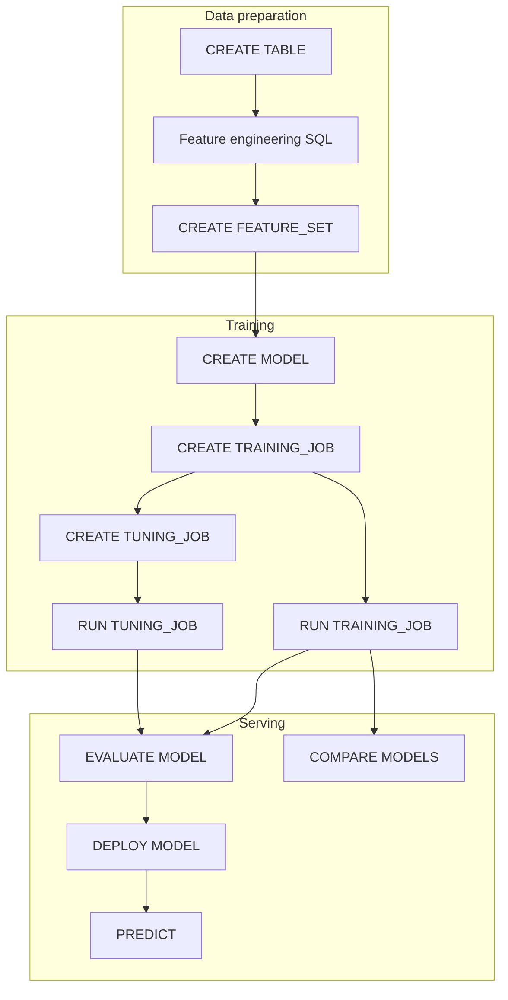

# ML Workflows

End-to-end machine learning workflows in Mnemo SQL: data preparation, feature engineering, model registration, hyperparameter tuning, training, evaluation, deployment, prediction, and monitoring.

Mnemo separates **business assets** (`MODEL`) from **implementations** (`ALGORITHM` + `FRAMEWORK`). Features, entity keys, and targets are **never inferred** — they must be declared in `FEATURE_SET`.

## Workflow overview



## Prerequisites

- Running Mnemosyne server (default `http://127.0.0.1:1143`)
- Python ML runtime dependencies for training/inference:
  - `scikit-learn`, `pandas`, `numpy`, `joblib`
  - Optional: `optuna` for advanced tuning strategies
- Set `MNEMO_PYTHON` if the server should use a specific interpreter

```bash
pip install scikit-learn pandas numpy joblib
# optional
pip install optuna
```

---

## Step 1: Create database and seed source data

```sql
CREATE DATABASE IF NOT EXISTS model_test_db;
USE model_test_db;

DROP TABLE IF EXISTS ml_customers;
DROP FEATURE_SET IF EXISTS churn_features;
DROP MODEL IF EXISTS churn_model;
DROP TRAINING_JOB IF EXISTS churn_training;

CREATE TABLE ml_customers (
    customer_id     Int64,
    tenure          Int64,
    monthly_charges Float64,
    support_calls   Int64,
    churn           Int64
) ENGINE = Memory;

INSERT INTO ml_customers VALUES
    (1, 3, 95.50, 6, 1),
    (2, 24, 45.00, 1, 0),
    (3, 12, 88.20, 4, 1),
    (4, 36, 42.10, 0, 0);
-- ... load 50–100+ rows for stable metrics
```

### Python: seed programmatically

```python
import random
from scripts._mnemo_client import Client

client = Client("http://127.0.0.1:1143")
rng = random.Random(13)

def seed_row(i: int) -> str:
    churn = 1 if rng.random() < 0.5 else 0
    tenure = int(max(1, rng.gauss(24 - 14 * churn, 4)))
    charges = round(rng.gauss(55 + 35 * churn, 8), 2)
    support = int(max(0, rng.gauss(1 + 3 * churn, 1)))
    return f"({i}, {tenure}, {charges}, {support}, {churn})"

values = ", ".join(seed_row(i) for i in range(1, 61))
client.query("CREATE DATABASE IF NOT EXISTS model_test_db")
client.query("USE model_test_db")
client.query(
    "CREATE TABLE ml_customers (customer_id Int64, tenure Int64, "
    "monthly_charges Float64, support_calls Int64, churn Int64) ENGINE=Memory"
)
client.query(f"INSERT INTO ml_customers VALUES {values}")
```

---

## Step 2: Feature engineering

Feature engineering happens in SQL **before** you declare a `FEATURE_SET`. Mnemo does not auto-discover columns.

### Derived features in SQL

```sql
-- Bucket tenure for tree models
CREATE TABLE ml_customers_enriched (
    customer_id     Int64,
    tenure          Int64,
    tenure_bucket   String,
    monthly_charges Float64,
    charges_per_month Float64,
    support_calls   Int64,
    churn           Int64
) ENGINE = Memory;

INSERT INTO ml_customers_enriched
SELECT
    customer_id,
    tenure,
    CASE
        WHEN tenure < 6  THEN 'new'
        WHEN tenure < 24 THEN 'mid'
        ELSE 'loyal'
    END AS tenure_bucket,
    monthly_charges,
    monthly_charges / greatest(tenure, 1) AS charges_per_month,
    support_calls,
    churn
FROM ml_customers;
```

### Train/validation split (SQL)

```sql
CREATE TABLE train_set ENGINE = Memory AS
SELECT * FROM ml_customers WHERE customer_id % 5 != 0;

CREATE TABLE holdout_set ENGINE = Memory AS
SELECT * FROM ml_customers WHERE customer_id % 5 = 0;
```

For the catalog `FEATURE_SET`, point `FROM` at the table you want the runtime to read:

```sql
CREATE FEATURE_SET churn_features
    FROM ml_customers
    ENTITY_KEY(customer_id)
    FEATURES(tenure, monthly_charges, support_calls)
    TARGET churn;
```

### FEATURE_SET properties

| Property | Description |
|----------|-------------|
| `name` | Feature set identifier |
| `source_table` | Table in `FROM` clause |
| `entity_key` | Primary key column for entity lookup predictions |
| `features` | Input column list |
| `target` | Label column (empty for unsupervised) |
| `version` | Increments on schema changes |

```sql
SHOW FEATURE_SETS;
DESCRIBE FEATURE_SET churn_features;
```

---

## Step 3: Register the model (business asset)

```sql
CREATE MODEL churn_model TYPE CLASSIFICATION;

-- Optional: attach default framework/algorithm at registration time
CREATE MODEL churn_model_v2 TYPE CLASSIFICATION
    FRAMEWORK SKLEARN
    ALGORITHM RandomForestClassifier;
```

### MODEL properties

| Property | Description |
|----------|-------------|
| `name` | Logical model name |
| `type` | `CLASSIFICATION`, `REGRESSION`, `FORECASTING`, `RECOMMENDATION`, `CLUSTERING`, `EMBEDDING`, `LLM`, `RL`, `CUSTOM` |
| `status` | Lifecycle state (`REGISTERED`, …) |
| `latest_version` | Highest trained version number (0 if never trained) |
| `owner` | Optional owner string |

```sql
SHOW MODELS;
DESCRIBE MODEL churn_model;
```

---

## Step 4: Define a training job

```sql
CREATE TRAINING_JOB churn_training
    MODEL churn_model
    FEATURE_SET churn_features
    FRAMEWORK SKLEARN
    ALGORITHM RandomForestClassifier
    OBJECTIVE ACCURACY
    HYPERPARAMS(n_estimators=60, max_depth=6, random_state=42);
```

### TRAINING_JOB properties

| Property | Description |
|----------|-------------|
| `name` | Job identifier |
| `model` | Target `MODEL` name |
| `feature_set` | Bound `FEATURE_SET` |
| `framework` | `SKLEARN`, `XGBOOST`, `LIGHTGBM`, `PYTORCH`, … |
| `algorithm` | Framework class name |
| `objective` | Metric to optimize/report (`ACCURACY`, `F1`, `ROC_AUC`, …) |
| `hyperparams` | Key-value map passed to the algorithm |

```sql
SHOW TRAINING_JOBS;
DESCRIBE TRAINING_JOB churn_training;
```

---

## Step 5: Run training

```sql
RUN TRAINING_JOB churn_training;
```

On success the server:

1. Spawns the Python ML runtime
2. Loads features from `churn_features` → `ml_customers`
3. Fits `RandomForestClassifier` with given hyperparameters
4. Registers **model version** `v1` with artifact path and metrics
5. Returns a JSON result with status `SUCCEEDED` and `ACCURACY`

```sql
SHOW MODEL VERSIONS churn_model;
DESCRIBE MODEL VERSION churn_model:v1;
```

### MODEL_VERSION properties

| Property | Description |
|----------|-------------|
| `model` | Parent model name |
| `version` | Integer version (`1`, `2`, …) |
| `run_id` | Training run identifier |
| `artifact_location` | Serialized model file path |
| `metrics` | Map of evaluation metrics |

---

## Step 6: Hyperparameter tuning (optional)

Define a tuning job referencing an existing training job:

```sql
CREATE TUNING_JOB tune_rf
    TRAINING_JOB churn_training
    STRATEGY RANDOM
    TRIALS 6
    OBJECTIVE ACCURACY
    SEARCH_SPACE(n_estimators='20..120', max_depth='2..12');
```

### TUNING_JOB properties

| Property | Description |
|----------|-------------|
| `name` | Tuning job identifier |
| `training_job` | Base job whose model/feature set are reused |
| `strategy` | `GRID`, `RANDOM`, `OPTUNA`, `BAYESIAN`, … |
| `trials` | Number of search iterations |
| `search_space` | Parameter ranges (`'10..200'`, `'0.01,0.1,0.3'`) |
| `objective` | Metric to maximize/minimize |

```sql
RUN TUNING_JOB tune_rf;
```

The result lists one row per trial plus a `best -> vN` summary. The best configuration registers a new model version.

Alternative with explicit model binding:

```sql
CREATE TUNING_JOB tune_rf_explicit
    MODEL churn_model
    FEATURE_SET churn_features
    FRAMEWORK SKLEARN
    ALGORITHM RandomForestClassifier
    STRATEGY BAYESIAN
    TRIALS 20
    OBJECTIVE ACCURACY
    SEARCH_SPACE(max_depth=3:10, n_estimators=50:200);
```

---

## Step 7: Evaluate

```sql
EVALUATE MODEL churn_model:1;
```

Returns metrics on the training/holdout data (aligned with `OBJECTIVE`). Use this before deployment.

```sql
-- Compare two algorithms or versions
CREATE MODEL churn_model_b TYPE CLASSIFICATION;

CREATE TRAINING_JOB churn_training_b
    MODEL churn_model_b
    FEATURE_SET churn_features
    FRAMEWORK SKLEARN
    ALGORITHM LogisticRegression
    OBJECTIVE ACCURACY;

RUN TRAINING_JOB churn_training_b;

COMPARE MODELS churn_model:1, churn_model_b:1;
```

---

## Step 8: Deploy

```sql
DEPLOY MODEL churn_model:1 AS churn_endpoint;
```

### MODEL_ENDPOINT properties

| Property | Description |
|----------|-------------|
| `name` | Endpoint alias (`churn_endpoint`) |
| `model` | Parent model |
| `version` | Deployed version |
| `status` | `ACTIVE`, `STARTING`, `FAILED`, … |
| `prediction_count` | Total predictions served |
| `failure_count` | Failed prediction count |
| `total_latency_ms` | Cumulative latency |

```sql
SHOW MODEL ENDPOINTS churn_model;
SHOW MODEL METRICS churn_model;
SHOW MODEL DRIFT churn_model;
```

---

## Step 9: Predict

### Mode 1: WITH — direct feature vector

Score a single row without looking up the entity:

```sql
PREDICT MODEL churn_model:1 WITH (
    tenure=2,
    monthly_charges=95.0,
    support_calls=5
);
```

Returns: `prediction`, `confidence`, and related fields.

### Mode 2: FOR — entity lookup

Resolve features from the training `FEATURE_SET` by entity key:

```sql
PREDICT MODEL churn_model:1 FOR (customer_id=2);
```

Returns: `entity_key`, `prediction`, `confidence`.

### Mode 3: FROM — batch scoring

Score every row and materialize a prediction table:

```sql
PREDICT MODEL churn_model:1 FROM ml_customers;
```

Creates `{model_name}_predictions` (e.g. `churn_model_predictions`):

```sql
SELECT * FROM churn_model_predictions LIMIT 10;
SELECT COUNT(*) FROM churn_model_predictions;
```

### Prediction table analysis

```sql
-- Confusion-style breakdown (actual vs predicted)
SELECT
    c.churn AS actual,
    p.prediction AS predicted,
    count(*) AS n
FROM ml_customers c
JOIN churn_model_predictions p ON p.entity_key = cast(c.customer_id AS String)
GROUP BY actual, predicted;
```

---

## Step 10: Reproducibility checklist

Every prediction traces to:

| Artifact | SQL to inspect |
|----------|----------------|
| Feature set | `DESCRIBE FEATURE_SET churn_features` |
| Training job | `DESCRIBE TRAINING_JOB churn_training` |
| Model version | `DESCRIBE MODEL VERSION churn_model:v1` |
| Hyperparameters | In training job / version metadata |
| Endpoint | `SHOW MODEL ENDPOINTS churn_model` |

---

## Complete Python workflow script

```python
#!/usr/bin/env python3
"""Minimal churn model lifecycle via Mnemo HTTP API."""
from scripts._mnemo_client import Client

DB, TABLE = "model_test_db", "ml_customers"
FS, MODEL, JOB, EP = "churn_features", "churn_model", "churn_training", "churn_ep"

client = Client("http://127.0.0.1:1143")

def run(sql: str) -> None:
    r = client.query(sql)
    if not r.ok():
        raise RuntimeError(f"{sql}\n=> {r.status} {r.body}")

# 1. Data
run(f"CREATE DATABASE IF NOT EXISTS {DB}")
run(f"USE {DB}")
run(f"CREATE TABLE {TABLE} (customer_id Int64, tenure Int64, "
    f"monthly_charges Float64, support_calls Int64, churn Int64) ENGINE=Memory")
# ... INSERT rows ...

# 2. Features + model + job
run(f"CREATE FEATURE_SET {FS} FROM {TABLE} "
    f"ENTITY_KEY(customer_id) FEATURES(tenure, monthly_charges, support_calls) TARGET churn")
run(f"CREATE MODEL {MODEL} TYPE CLASSIFICATION")
run(f"CREATE TRAINING_JOB {JOB} MODEL {MODEL} FEATURE_SET {FS} "
    f"FRAMEWORK SKLEARN ALGORITHM RandomForestClassifier OBJECTIVE ACCURACY "
    f"HYPERPARAMS(n_estimators=60, max_depth=6)")

# 3. Train → evaluate → deploy → predict
run(f"RUN TRAINING_JOB {JOB}")
run(f"EVALUATE MODEL {MODEL}:1")
run(f"DEPLOY MODEL {MODEL}:1 AS {EP}")
run(f"PREDICT MODEL {MODEL}:1 WITH (tenure=2, monthly_charges=95.0, support_calls=5)")
run(f"PREDICT MODEL {MODEL}:1 FOR (customer_id=2)")
run(f"PREDICT MODEL {MODEL}:1 FROM {TABLE}")
```

Reference implementation: `scripts/test_models_api.py`, `scripts/test_tuning_api.py`.

---

## MODEL_TEMPLATE shortcut

Reuse a framework/algorithm/hyperparameter preset:

```sql
CREATE MODEL_TEMPLATE rf_churn_template
    TYPE CLASSIFICATION
    FRAMEWORK SKLEARN
    ALGORITHM RandomForestClassifier
    HYPERPARAMS(n_estimators=100, max_depth=8);

CREATE TRAINING_JOB churn_from_template
    MODEL churn_model
    FEATURE_SET churn_features
    FRAMEWORK SKLEARN
    ALGORITHM RandomForestClassifier
    OBJECTIVE ACCURACY
    HYPERPARAMS(n_estimators=100, max_depth=8);
```

---

## Error handling

| Scenario | Expected behavior |
|----------|-------------------|
| Missing ML libraries | `RUN TRAINING_JOB` fails with library/missing error |
| Unknown job | `RUN TRAINING_JOB missing` → error |
| Duplicate model | `CREATE MODEL` without `IF NOT EXISTS` fails |
| Invalid feature column | Training fails at runtime with column error |

Always use `IF NOT EXISTS` / `IF EXISTS` in idempotent setup scripts.
